# GlobeMed Healthcare Management System

## Foundation & Overview Document

**Project Name**: GlobeMed Healthcare Management System

**Repository**: isharax9/healthcare-system | [https://github.com/isharax9/healthcare-system](https://github.com/isharax9/healthcare-system)

Published Doc: [https://macna.gitbook.io/macna.lk/globemed-hms-docs](https://macna.gitbook.io/macna.lk/globemed-hms-docs)

**Author**: Ishara Lakshitha

**Purpose**: Academic/Educational - Design Patterns Implementation

---

## Table Of Content

---

## 1. Project Introduction

The GlobeMed Healthcare Management System is a comprehensive Java-based desktop application designed to demonstrate advanced software engineering principles through practical implementation of specific design patterns. This system serves as both a functional healthcare management solution and an educational resource for understanding enterprise-level software architecture with targeted pattern implementations.

### Key Features

- **Patient Record Management** with state restoration using Memento Pattern
- **Appointment Scheduling** with complex interaction mediation using Mediator Pattern
- **Billing & Insurance Processing** with flexible workflow using Chain of Responsibility Pattern
- **Role-Based Access Control** with dynamic permissions using Decorator Pattern
- **Medical Report Generation** with extensible operations using Visitor Pattern
- **Security Implementation** through multiple complementary patterns

---

## 2. System Objectives

### Primary Educational Objectives

- **Targeted Pattern Implementation**: Demonstrate real-world application of 6 specific design patterns
- **Problem-Solving Architecture**: Each module addresses specific healthcare domain problems
- **Clean Architecture**: Showcase proper separation of concerns and layered architecture
- **Security Through Design**: Role-based access control with comprehensive data protection

### Functional Objectives

- **Complete Healthcare Workflow**: Patient registration to billing completion
- **Multi-Role User Support**: Doctors, Nurses, and Administrative staff with distinct capabilities
- **Data Integrity & Recovery**: State management with undo functionality
- **Flexible Processing**: Configurable workflow chains for billing operations
- **Comprehensive Reporting**: Extensible report generation system

---

## 3. Technology Stack

### Core Technologies

| Component | Technology / Version |
| --- | --- |
| **Language** | Java |
| **Development Kit** | JDK 21 |
| **Database** | MySQL 9.3.0 |
| **UI Framework** | Java SE Swing |
| **PDF Generation** | iTextPDF Library, pdfBox Library |
| **Build Tool** | Apache Maven |

### Dependencies & Libraries

```xml
<!-- Database Connectivity -->
<dependency>
    <groupId>com.mysql</groupId>
    <artifactId>mysql-connector-j</artifactId>
    <version>8.2.0</version>
</dependency>

<!-- PDF Generation -->
<dependency>
    <groupId>com.itextpdf</groupId>
    <artifactId>itextpdf</artifactId>
    <version>5.5.13.3</version>
</dependency>

<!-- PDF Utilities -->
<dependency>
    <groupId>org.apache.pdfbox</groupId>
    <artifactId>pdfbox</artifactId>
    <version>2.0.29</version>
</dependency>

```

---

## 4. Architecture Overview

### Entity-Relationship Diagram (EER)


### Complete Application UML Class Diagram

```mermaid
classDiagram
    %% Main Application Classes
    class Main {
        -AuthService authService
        -MainFrame mainFrame
        +main(String[] args)
        +startApp()
        +restart()
    }

    %% Part A: Patient Record Management (Memento + Prototype Patterns)
    class PatientRecord {
        -String patientId
        -String name
        -List~String~ medicalHistory
        -List~String~ treatmentPlans
        -InsurancePlan insurancePlan
        +save() PatientRecordMemento
        +restore(PatientRecordMemento memento)
        +clone() PatientRecord
        +getPatientId() String
        +getName() String
        +getMedicalHistory() List~String~
        +getTreatmentPlans() List~String~
        +getInsurancePlan() InsurancePlan
    }

    class PatientRecordMemento {
        -String name
        -List~String~ medicalHistory
        -List~String~ treatmentPlans
        +getName() String
        +getMedicalHistory() List~String~
        +getTreatmentPlans() List~String~
    }

    class RecordHistory {
        -Stack~PatientRecordMemento~ history
        -PatientRecord patientRecord
        +save()
        +undo()
    }

    %% Part B: Appointment Scheduling (Mediator Pattern)
    class AppointmentMediator {
        <<interface>>
        +scheduleAppointment(String patientId, String doctorId, LocalDateTime dateTime, String reason) boolean
        +cancelAppointment(int appointmentId) boolean
        +checkConflicts(String doctorId, LocalDateTime dateTime) boolean
    }

    class AppointmentScheduler {
        -List~Appointment~ appointments
        -PatientDAO patientDAO
        -DoctorDAO doctorDAO
        +scheduleAppointment(String patientId, String doctorId, LocalDateTime dateTime, String reason) boolean
        +cancelAppointment(int appointmentId) boolean
        +checkConflicts(String doctorId, LocalDateTime dateTime) boolean
        +getAllAppointments() List~Appointment~
    }

    class Appointment {
        -int appointmentId
        -String patientId
        -String doctorId
        -LocalDateTime appointmentDateTime
        -String reason
        -String status
        -String doctorNotes
        -LocalDateTime lastUpdated
        -String lastUpdatedBy
        +accept(ReportVisitor visitor)
    }

    %% Part C: Billing and Insurance Claims (Chain of Responsibility Pattern)
    class BillingHandler {
        <<interface>>
        +setNext(BillingHandler next)
        +processBill(BillProcessingRequest request) boolean
    }

    class ValidationHandler {
        -BillingHandler next
        +setNext(BillingHandler next)
        +processBill(BillProcessingRequest request) boolean
    }

    class InsuranceHandler {
        -BillingHandler next
        +setNext(BillingHandler next)
        +processBill(BillProcessingRequest request) boolean
    }

    class PaymentHandler {
        -BillingHandler next
        +setNext(BillingHandler next)
        +processBill(BillProcessingRequest request) boolean
    }

    class MedicalBill {
        -int billId
        -String patientId
        -double amount
        -String status
        -List~String~ logs
        -InsurancePlan appliedInsurancePlan
        -double insurancePayment
        +applyInsurancePayment(double amount)
        +addLog(String log)
        +setStatus(String status)
        +accept(ReportVisitor visitor)
    }

    class BillProcessingRequest {
        -MedicalBill bill
        -PatientRecord patient
        +getBill() MedicalBill
        +getPatient() PatientRecord
    }

    %% Part D: Staff Roles and Permissions (Decorator Pattern)
    class IUser {
        <<interface>>
        +getUsername() String
        +getRole() String
        +getDoctorId() String
        +hasPermission(String permission) boolean
    }

    class BaseUser {
        -String username
        -String role
        -String doctorId
        +getUsername() String
        +getRole() String
        +getDoctorId() String
        +hasPermission(String permission) boolean
    }

    class UserDecorator {
        <<abstract>>
        -IUser user
        +getUsername() String
        +getRole() String
        +getDoctorId() String
        +hasPermission(String permission) boolean
    }

    class AdminPermissionDecorator {
        +hasPermission(String permission) boolean
    }

    class DoctorPermissionDecorator {
        +hasPermission(String permission) boolean
    }

    class NursePermissionDecorator {
        +hasPermission(String permission) boolean
    }

    class AuthService {
        -Map~String,IUser~ users
        +authenticate(String username, String password) IUser
        +registerUser(String username, String password, String role, String doctorId)
    }

    %% Part E: Medical Reports (Visitor Pattern)
    class ReportVisitor {
        <<interface>>
        +visitPatient(PatientRecord patient)
        +visitAppointment(Appointment appointment)
        +visitBill(MedicalBill bill)
    }

    class Visitable {
        <<interface>>
        +accept(ReportVisitor visitor)
    }

    class PatientSummaryVisitor {
        -StringBuilder report
        +visitPatient(PatientRecord patient)
        +visitAppointment(Appointment appointment)
        +visitBill(MedicalBill bill)
        +getReport() String
    }

    class FinancialReportVisitor {
        -double totalRevenue
        -double totalInsuranceClaims
        -StringBuilder report
        +visitPatient(PatientRecord patient)
        +visitAppointment(Appointment appointment)
        +visitBill(MedicalBill bill)
        +getReport() String
    }

    %% Insurance System
    class InsurancePlan {
        -int planId
        -String planName
        -double coveragePercent
        +getPlanId() int
        +getPlanName() String
        +getCoveragePercent() double
    }

    %% Data Access Layer
    class PatientDAO {
        +getAllPatients() List~PatientRecord~
        +getPatientById(String id) PatientRecord
        +savePatient(PatientRecord patient)
        +updatePatient(PatientRecord patient)
        +deletePatient(String id)
    }

    class AppointmentDAO {
        +getAllAppointments() List~Appointment~
        +getAppointmentById(int id) Appointment
        +saveAppointment(Appointment appointment)
        +updateAppointment(Appointment appointment)
        +deleteAppointment(int id)
    }

    class InsuranceDAO {
        +getAllPlans() List~InsurancePlan~
    }

    class DatabaseManager {
        -String JDBC_URL
        -String USERNAME
        -String PASSWORD
        -Connection connection
        +getConnection() Connection
        +closeConnection()
    }

    %% UI Layer
    class MainFrame {
        -IUser currentUser
        -Main appInstance
        -JTabbedPane tabbedPane
        +createMenuBar()
        +toggleDarkMode()
        +logout()
    }

    class LoginDialog {
        -AuthService authService
        -IUser authenticatedUser
        +getAuthenticatedUser() IUser
    }

    class PatientPanel {
        -JTable patientTable
        -JButton addButton
        -JButton editButton
        -JButton deleteButton
    }

    class AppointmentPanel {
        -JTable appointmentTable
        -JButton scheduleButton
        -JButton cancelButton
    }

    class BillingPanel {
        -JTable billTable
        -JButton createBillButton
        -JButton processBillButton
    }

    class ReportPanel {
        -JComboBox reportTypeCombo
        -JButton generateButton
        -JTextArea reportArea
    }

    class StaffPanel {
        -JTable staffTable
        -JButton addStaffButton
        -JButton editStaffButton
    }

    %% Controllers (MVC Pattern)
    class PatientController {
        -PatientPanel view
        -PatientDAO dao
        -MainFrame parent
        -IUser currentUser
        +handleAddPatient()
        +handleEditPatient()
        +handleDeletePatient()
    }

    class AppointmentController {
        -AppointmentPanel view
        -AppointmentScheduler scheduler
        -MainFrame parent
        -IUser currentUser
        +handleScheduleAppointment()
        +handleCancelAppointment()
    }

    class BillingController {
        -BillingPanel view
        -BillingHandler billingChain
        -MainFrame parent
        -IUser currentUser
        +handleCreateBill()
        +handleProcessBill()
    }

    class ReportController {
        -ReportPanel view
        -MainFrame parent
        -IUser currentUser
        +handleGenerateReport()
    }

    class StaffController {
        -StaffPanel view
        -AuthService authService
        -MainFrame parent
        -IUser currentUser
        +handleAddStaff()
        +handleEditStaff()
    }

    %% Relationships

    %% Main Application
    Main --> AuthService
    Main --> MainFrame
    MainFrame --> IUser
    MainFrame --> PatientPanel
    MainFrame --> AppointmentPanel
    MainFrame --> BillingPanel
    MainFrame --> ReportPanel
    MainFrame --> StaffPanel

    %% Memento Pattern (Part A)
    PatientRecord --> PatientRecordMemento : creates
    RecordHistory --> PatientRecordMemento : stores
    RecordHistory --> PatientRecord : manages

    %% Mediator Pattern (Part B)
    AppointmentScheduler ..|> AppointmentMediator
    AppointmentScheduler --> Appointment : manages
    Appointment ..|> Visitable

    %% Chain of Responsibility Pattern (Part C)
    ValidationHandler ..|> BillingHandler
    InsuranceHandler ..|> BillingHandler
    PaymentHandler ..|> BillingHandler
    ValidationHandler --> InsuranceHandler : next
    InsuranceHandler --> PaymentHandler : next
    BillingHandler --> BillProcessingRequest : processes
    BillProcessingRequest --> MedicalBill
    BillProcessingRequest --> PatientRecord
    MedicalBill ..|> Visitable

    %% Decorator Pattern (Part D)
    BaseUser ..|> IUser
    UserDecorator ..|> IUser
    UserDecorator --> IUser : wraps
    AdminPermissionDecorator --|> UserDecorator
    DoctorPermissionDecorator --|> UserDecorator
    NursePermissionDecorator --|> UserDecorator
    AuthService --> IUser : creates

    %% Visitor Pattern (Part E)
    PatientSummaryVisitor ..|> ReportVisitor
    FinancialReportVisitor ..|> ReportVisitor
    PatientRecord ..|> Visitable
    PatientRecord --> InsurancePlan

    %% Data Access
    PatientDAO --> DatabaseManager
    AppointmentDAO --> DatabaseManager
    InsuranceDAO --> DatabaseManager
    PatientDAO --> PatientRecord
    AppointmentDAO --> Appointment
    InsuranceDAO --> InsurancePlan

    %% Controllers
    PatientController --> PatientPanel
    PatientController --> PatientDAO
    AppointmentController --> AppointmentPanel
    AppointmentController --> AppointmentScheduler
    BillingController --> BillingPanel
    BillingController --> BillingHandler
    ReportController --> ReportPanel
    ReportController --> ReportVisitor
    StaffController --> StaffPanel
    StaffController --> AuthService
```




(You can find the High Res images in the Github Project Repo)

### System Architecture Type

**Layered Architecture with Pattern-Specific Module Design**

```
┌─────────────────────────────────────────┐
│             Presentation Layer          │
│     (UI Panels, Controllers, Dialogs)   │
├─────────────────────────────────────────┤
│              Business Layer             │
│  (Pattern Implementations, Domain Logic)│
├─────────────────────────────────────────┤
│            Data Access Layer            │
│         (DAOs, Database Manager)        │
├─────────────────────────────────────────┤
│             Database Layer              │
│          (MySQL Database)               │
└─────────────────────────────────────────┘

```

---

## 5. System Requirements

### Minimum System Requirements

- **Operating System**: Windows 10+, macOS 10.14+, Linux (Ubuntu 18.04+)
- **Java Runtime**: JRE 21 or higher
- **Memory**: 4GB RAM minimum, 8GB recommended
- **Storage**: 100MB for application, 1GB for data
- **Database**: MySQL 8.0+ or MariaDB 10.3+

### Development Requirements

- **JDK**: OpenJDK 21 or Oracle JDK 21+
- **Build Tool**: Apache Maven 3.8+
- **Database**: MySQL Server 9.3.0+ with admin privileges
- **IDE**: IntelliJ IDEA 2023+, Eclipse 2023+, or VS Code with Java extensions

---

## 6. Project Structure

### Package Organization by Design Pattern

```
com.globemed/
├── Main.java                           # Application Entry Point
├── patient/                           # Part A: Memento & Prototype Patterns
│   ├── PatientRecord.java             # Originator (Memento) + Prototype
│   ├── PatientRecordMemento.java      # Memento class
│   └── RecordHistory.java             # Caretaker for undo functionality
├── appointment/                       # Part B: Mediator Pattern
│   ├── Appointment.java               # Domain entity
│   ├── Doctor.java                    # Domain entity
│   └── AppointmentScheduler.java      # Mediator for complex scheduling
├── billing/                          # Part C: Chain of Responsibility
│   ├── MedicalBill.java              # Request object
│   ├── Handler.java                  # Abstract handler interface
│   ├── ValidationHandler.java        # Concrete handler
│   ├── InsuranceHandler.java         # Concrete handler
│   └── FinalBillingHandler.java      # Concrete handler
├── auth/                             # Part D: Decorator Pattern
│   ├── IUser.java                    # Component interface
│   ├── BaseUser.java                 # Concrete component
│   ├── UserRoleDecorator.java        # Abstract decorator
│   ├── DoctorRole.java               # Concrete decorator
│   ├── AdminRole.java                # Concrete decorator
│   └── AuthService.java              # Authentication service
├── reports/                          # Part E: Visitor Pattern
│   ├── Visitable.java                # Element interface
│   ├── ReportVisitor.java            # Visitor interface
│   ├── PatientSummaryReportVisitor.java   # Concrete visitor
│   ├── FinancialReportVisitor.java        # Concrete visitor
│   └── AgedReceivablesReportVisitor.java  # Concrete visitor
├── staff/                            # Supporting entities
│   └── Staff.java                    # Staff management
├── insurance/                        # Supporting entities
│   └── InsurancePlan.java            # Insurance coverage
├── db/                              # Data Access Layer (DAO Pattern)
│   ├── DatabaseManager.java         # Connection management
│   ├── PatientDAO.java              # Patient data operations
│   ├── SchedulingDAO.java           # Appointment data operations
│   ├── BillingDAO.java              # Billing data operations
│   └── StaffDAO.java                # Staff data operations
├── controller/                      # MVC Controllers
│   ├── PatientController.java       # Patient management logic
│   ├── AppointmentController.java   # Appointment management logic
│   ├── BillingController.java       # Billing management logic
│   ├── ReportController.java        # Report generation logic
│   └── StaffController.java         # Staff management logic
├── ui/                             # User Interface Layer
│   ├── MainFrame.java              # Main application window
│   ├── LoginDialog.java            # Authentication interface
│   ├── PatientPanel.java           # Patient management UI
│   ├── AppointmentPanel.java       # Appointment management UI
│   ├── BillingPanel.java           # Billing management UI
│   ├── ReportPanel.java            # Report generation UI
│   └── StaffPanel.java             # Staff management UI
└── utils/                          # Utility Classes
    ├── BillPrinter.java            # PDF generation utilities
    └── TextReportPrinter.java      # Report formatting utilities

```

---

## 7. Core Application Modules & Design Patterns

### 7.1 Part A: Patient Record Management

- **Patterns Used:** Memento, Prototype
- **Key Classes**: `PatientRecord` (Originator), `PatientRecordMemento`, `RecordHistory` (Caretaker)
- **Implementation**:
    - Memento pattern captures patient state for undo functionality
    - Prototype pattern enables efficient patient template creation
- **Problem Solved**: State restoration without breaking encapsulation

### 7.2 Part B: Appointment Scheduling

- **Pattern Used:** Mediator
- **Key Class**: `AppointmentScheduler` (Mediator)
- **Implementation**:
    - Centralizes complex scheduling logic
    - Manages interactions between Patients, Doctors, and Schedules
    - Handles conflict detection and booking validation
- **Problem Solved**: Reduces coupling between scheduling components

### 7.3 Part C: Billing and Insurance Claims

- **Pattern Used:** Chain of Responsibility
- **Key Classes**: `ValidationHandler`, `InsuranceHandler`, `FinalBillingHandler`
- **Implementation**:
    - Multi-step billing workflow
    - Each handler performs specific processing
    - Flexible chain configuration
- **Problem Solved**: Extensible processing pipeline for complex billing rules

### 7.4 Part D: Managing Medical Staff Roles and Permissions

- **Pattern Used:** Decorator
- **Key Classes**: `IUser` (Component), `BaseUser`, `DoctorRole`, `AdminRole` (Decorators)
- **Implementation**:
    - Dynamic permission assignment at runtime
    - Flexible role composition
    - Layered permission system
- **Problem Solved**: Role-based access control without rigid inheritance

### 7.5 Part E: Generating Medical Reports

- **Pattern Used:** Visitor
- **Key Classes**: `ReportVisitor`, `PatientSummaryReportVisitor`, `FinancialReportVisitor`
- **Implementation**:
    - Separates report logic from data models
    - Extensible report types
    - Traverses object structures for data collection
- **Problem Solved**: Add new report types without modifying core models

### 7.6 Part F: Security Considerations

- **Patterns Discussed:** Decorator, DAO
- **Implementation**:
    - Decorator pattern provides access control foundation
    - DAO pattern centralizes database security
    - Parameterized queries prevent SQL injection
- **Problem Solved**: Comprehensive security through design patterns

---

## 8. Getting Started

### 8.1 Prerequisites

```bash
# Verify Java installation
java --version  # Should show Java 21+

# Verify Maven installation
mvn --version   # Should show Maven 3.8+

# Verify MySQL installation
mysql --version # Should show MySQL 8.0+

```

### 8.2 Database Setup

```sql
-- 1. Create database
CREATE DATABASE globemed_db;

-- 2. Import schema
mysql -u root -p globemed_db < globemed_db.sql

-- 3. Verify tables
USE globemed_db;
SHOW TABLES;

```

### 8.3 Application Compilation

```bash
# 1. Clone/Extract repository
cd healthcare-system

# 2. Compile project
mvn clean compile

# 3. Run application
mvn exec:java -Dexec.mainClass="com.globemed.Main"

```

### 8.4 Design Pattern Testing Flow

1. **Patient Management (Memento/Prototype)**: Create patient → Edit → Use Undo functionality
2. **Appointment Scheduling (Mediator)**: Book appointments → Observe conflict resolution
3. **Billing Processing (Chain of Responsibility)**: Process bills → See multi-step validation
4. **Role Management (Decorator)**: Login with different roles → Observe permission differences
5. **Report Generation (Visitor)**: Generate various reports → See extensible report system

### 8.5 Default Login Credentials

| Role | Username | Password | Design Pattern Demo |
| --- | --- | --- | --- |
| Admin | admin | 1101 | Full Decorator permissions |
| Doctor | doc | 1101 | Doctor-specific decorations |
| Nurse | nurse | 1101 | Limited permission decorations |

## **9. User Interface (UI) Screenshots**

Please check the published doc to see the UI screenshots doc

---

## Next Documentation Phases

The subsequent documents will provide detailed analysis of each design pattern implementation:

- **Document 02**: Part A - Patient Record Management (Memento & Prototype Patterns)
- **Document 03**: Part B - Appointment Scheduling (Mediator Pattern)
- **Document 04**: Part C - Billing & Insurance Claims (Chain of Responsibility Pattern)
- **Document 05**: Part D - Staff Roles & Permissions (Decorator Pattern)
- **Document 06**: Part E - Medical Report Generation (Visitor Pattern)
- **Document 07**: Part F - Security Implementation & Additional Patterns

---